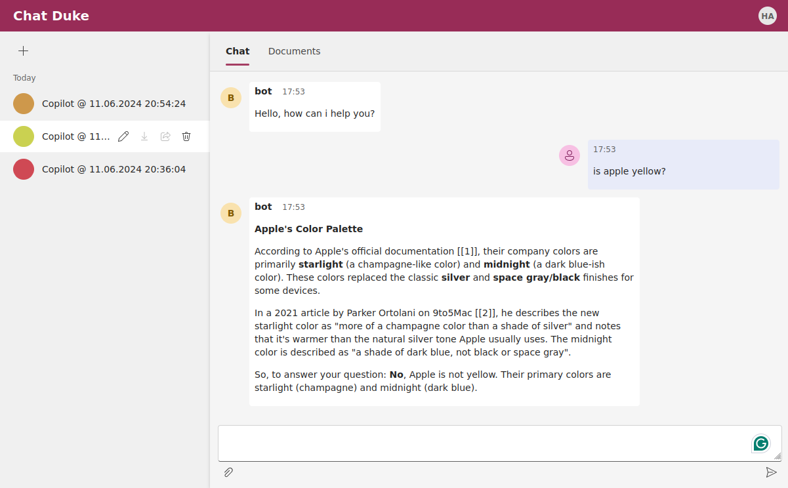

# Duke Java AI Assistant


Duke is an AI assistant software named after famous Java Mascot.
Duke is developed to show that a pure Java based AI assistant chatbot is possible. 
It is not complete yet. But the code is there, you can fork or inspect.

Right now, duke can make web searches and answer your questions. UI allows uploading files but RAG functionality is not complete yet.

## Components 

### Spring Boot & Spring AI & Spring Webflux

Duke is a Spring boot application. Spring AI is used to integrate with Ollama component.
The application is reactive web application. It allows tokens to stream into users browser as they are generated.

### Ollama 

Ollama allows local deployment of large language models and embedding models. Please refer to official ollama documentation for installation options.
Make sure application.yml file contains correct configuration for your ollama installation e.g. base_url, model names etc.

### UI

UI is a React application. I modified and simplified Microsoft Chat Copilot UI application.  



### Database

A file based H2 database is used to store chat history.

## Install & Run

Scripts directory includes scripts to install and run the application. 

### Scripts

Use install and launch scripts that can be found under `scripts` directory for the specific platform.

**Ubuntu**
```bash
./install-apt.sh
./start-backend.sh
./start-frontend.sh
```

**Windows**
```powershell
Install.ps1
Start-Backend.ps1
Start-Frontend.ps1
```

### Docker

The simplest approach would be using docker compose to launch the system. Docker compose configuration onyl involves backend and frontend applications.

```bash
./gradlew clean build
docker compose up
docker compose down
```